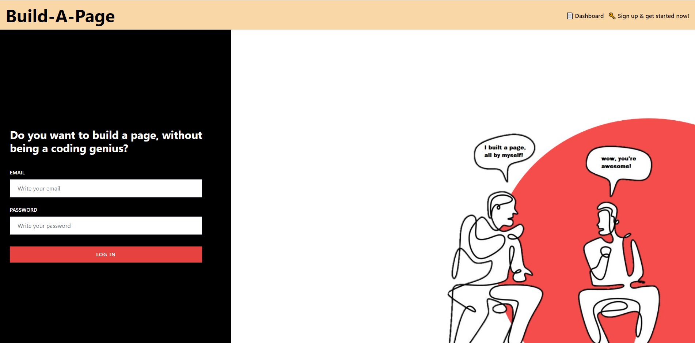
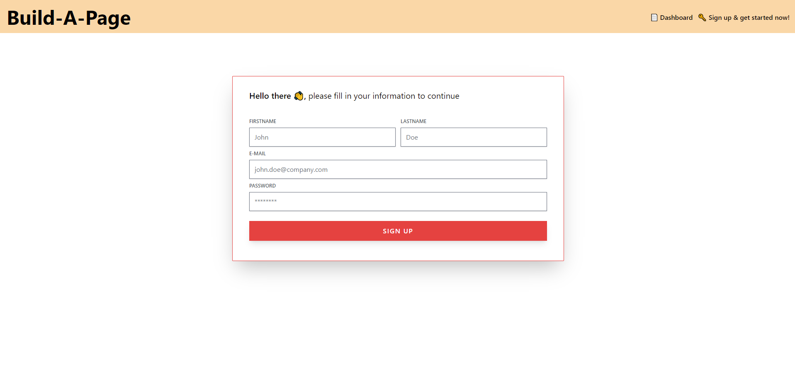
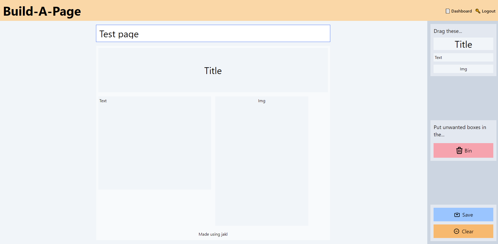
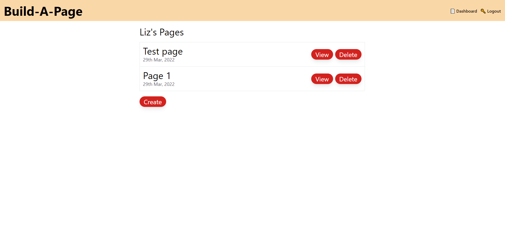

# 📄Build-A-Page📄
  

## Description
An easy drag and drop application that can be used with little to no technology experience that allows you to create simple templates for all your report and newsletter needs. A save feature is included that allows you to log back in and access your saved templates at any time. 

**User story:**

As a high school student with limited technology experience, I want to easily create a local community newsletter template so that I can save it and access it at a later date for all upcoming community meetings. 

**App built with:**
```
- JavaScript
- Bcrypt
- dotenv
- Express
- Express-session
- Express-handlebars
- MySql
- mysql2
- Gridstack
- PostCSS
- Tailwind CSS
- Sequelize
- Insomnia
- Heroku 
```
## Table of Contents

  - [Description](#description)
  - [Installation](#installation)
  - [Usage](#usage)
  - [Contribution](#contribution)
  - [Tests](#tests)
  - [License](#license)
  - [Questions](#questions)
  - [Credits](#credits)

## Installation
Clone the Github repository:<br>
`https://github.com/JackoWray/JAKL_Coding.git`

Install all dependencies required for application:<br>
`npm install` 
  
## Usage
To use this app, use the following commands:

Log into MySQL & enter your password<br>
`mysql -u root -p`

Source the schema<br>
`source schema.sql`

Seed the database<br>
`npm run seed`

Start the server<br>
`npm start`







## Contribution
Please feel free to contribute in any way by forking the repo and creating a pull request.

## Tests
No tests are available for this app.

## License
This project is using the MIT license.

## Questions❓
If you have any questions, please contact us via [Email](mailto:liz.mackle@outlook.com) or [GitHub](https://github.com/LizMackle).

## Credits
This app was created by [Jackson Wray](https://github.com/JackoWray) | [Kyle Bario](https://github.com/kbario) | [Liz Mackle](https://github.com/LizMackle)